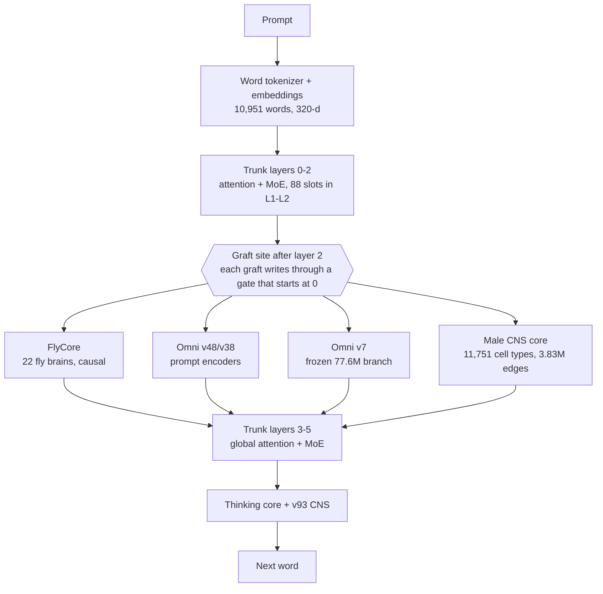

# Supermix Expanse

[](https://huggingface.co/Kai9987kai/supermix-expanse)

**Supermix Expanse** grafts, distils and fine-tunes five sources into one 132.6M-parameter PyTorch model, built and trained entirely on a laptop CPU:

| Source | How it enters Expanse |
|---|---|
| [Archimedes final](https://huggingface.co/Kai9987kai/archimedes-final-model) ([repo](https://github.com/kai9987kai/supermix-archimedes)) — v93 trunk, v87 experts, FlyCore, Omni v48/v38 | the trunk everything is grafted onto; a frozen copy is the anti-forgetting teacher |
| [Omni Collective v7 Frontier](https://huggingface.co/Kai9987kai/supermix-omni-collective-v7-frontier) | frozen 77.6M branch bridged into the residual stream + intent/domain distillation |
| [Qwen2.5-Coder-7B-Instruct](https://huggingface.co/Qwen/Qwen2.5-Coder-7B-Instruct) | 1,500 sandbox-verified code rows + 16 grafted MoE experts from its layer-0/1 MLP neurons |
| [BioMedLM 2.7B](https://huggingface.co/stanford-crfm/BioMedLM) | ~1,400 filtered biomedical rows + 16 grafted MoE experts from its layer-0/1 MLP neurons |
| The **full Janelia male CNS v1.0 connectome** ([natverse/malecns](https://github.com/natverse/malecns), [male-cns.janelia.org](https://male-cns.janelia.org/)) | a per-token recurrent core wired as the whole male fly CNS — all 11,751 cell types, all 3,830,931 type→type edges — plus 6,667 connectome fact rows |

**➡ The trained model is on Hugging Face: <https://huggingface.co/Kai9987kai/supermix-expanse>** (checkpoint, model card, receipts). This repository holds the full project: code, the teacher corpora actually used, the connectome graph, receipts and logs.

> **Status: experimental research model.** Expanse keeps and improves Archimedes' own skills, but its new code-writing and biomedical abilities are weak after one CPU training run — see [Results](#results). Qwen has no Qwen3-Coder at 7-8B, so the official Qwen2.5-Coder-7B-Instruct was used; BioMedLM replaced BioMistral-7B.

## How it works



* **Male CNS core** (`expanse/src/connectome_full.py`). Each token's layer-2 state drives the 1,277 sensory / visual / ascending cell types; activity runs 4 recurrent steps through every type→type edge of the male CNS v1.0 (122.3M typed synapses), each weighted by its **measured input fraction** and signed by the presynaptic neurotransmitter (Dale's law); the 713 descending / motor / efferent types are read out and written back through a zero-initialised gate. The wiring is fixed from data; only per-type gain, bias and leak (plus in/out projections) learn. Per-position, so causal and KV-cache exact. Sparse CSR in 128-column slabs: ~0.33 s forward + 0.35 s backward per 1,024 tokens on CPU.
* **Grafted experts** (`expanse/src/donor_graft.py`). New MoE slots (72 → 88 in layers 1-2) filled with 96-neuron experts carved from Qwen-Coder / BioMedLM layer-0/1 MLPs via ridge maps between single-token states, fold-in init (GELU emulated exactly as `silu(1.702z)/1.702`), local function-fit refinement, load-matched wake biases, dormant until 10-50% of training.
* **Omni v7 branch** (`expanse/src/omni_v7_branch.py`). The frozen v7 net reads the prompt once; its 988-d conclusion is bridged in, and its intent/domain predictions are distilled into the trunk.
* **FlyCore causality fix.** Archimedes' `FlyCore.sense` averaged over *all* positions (future tokens and padding included) — a future-token leak. Expanse senses per position.
* Every graft is born function-preserving: with the fly graft off, the grafted model reproduces Archimedes' logits with max |Δ| = 0.0.

[`expanse/DESIGN.md`](expanse/DESIGN.md) is the full spec.

## Results

Dev loss per source (nats/token on reply tokens; connectome dev = held-out *cell types*):

| source | Archimedes | Expanse |
|---|---|---|
| Archimedes replay (science / code tracing / arithmetic) | 0.787 | **0.418** |
| male-CNS connectome facts (rows both tokenizers cover) | 3.522 | **0.571** |
| fly rows | 4.609 | **1.198** |
| Qwen code rows | — (vocabulary cannot encode them) | 4.04 (from 9.86) |
| BioMedLM bio rows | — | 4.95 (from 8.25) |

* Agreement with Omni v7: intent 72.7%, domain 73.1%. Final gate magnitudes: CNS core 0.086, Omni v7 0.076.
* **Honest graft numbers:** teacher→student representation maps are weak (held-out R² 0.05-0.15); only **1 of 32** grafted experts reproduces its teacher neuron group on held-out tokens (R² 0.21). Most transferred knowledge comes from distillation.
* **Teacher data quality:** code answers kept only if they pass our own tests in a sandbox (92.8% pass); BioMedLM definitions kept if Qwen judged them accurate (94% — a lenient judge); PubMedQA answers capped because BioMedLM answers almost everything "yes" (59.3% on held-out vs a 60.5% always-yes baseline).
* Sample answers: arithmetic and code-tracing prompts are answered correctly in the house style; connectome questions are answered in the right format but sometimes to the wrong question; writing new functions and defining biomedical terms is not usable yet.
* Full held-out generation evaluation and ablations (CNS core off / on a degree-preserving rewired graph, Omni v7 off, donor experts off, fly off): `expanse/checkpoints/eval_report.md` (added when the run completes).

## Set it up yourself

### Requirements

* Python 3.10+ (developed on 3.12), PyTorch 2.4+ (CPU is fine; developed on torch 2.11 CPU).
* **Use fp32.** On CPUs without fast bf16 kernels (e.g. Windows ARM64), bf16 matmul is ~100× slower than fp32.
* Chatting / evaluating: ~3 GB RAM. Full reproduction: 16 GB RAM, ~25 GB free disk.

```bash
git clone https://github.com/kai9987kai/Supermix-expanse.git
cd Supermix-expanse
python -m venv .venv
source .venv/bin/activate            # Windows: .venv\Scripts\activate
pip install -r requirements.txt
```

### Option A — chat with the trained model (5 minutes)

```bash
hf download Kai9987kai/supermix-expanse supermix_expanse.pt --local-dir expanse/checkpoints
python expanse/expanse_chat.py      # opens http://127.0.0.1:7861
```

The chat UI streams answers and has live switches for each graft (CNS core, Omni v7, FlyCore, donor experts). To also compare against Archimedes, download its checkpoint first with `python external/fetch_base.py` (or just `hf download Kai9987kai/archimedes-final-model supermix_archimedes.pt --local-dir external/base`).

From Python:

```python
import sys, torch; sys.path.insert(0, "expanse/src")
import expanse_core as ec
model, tok, _ = ec.load_expanse("expanse/checkpoints/supermix_expanse.pt")
q = "whats the impulse from 40 N acting for 6 s"
ids, _ = tok.encode_turn(q, None)
out = ec.greedy_decode(model, torch.tensor([ids]), max_new_tokens=80,
                       omni_features=ec.arch.OmniCore.featurize([q]),
                       omni7_state=model.omni7_state_for([q]))
print(tok.decode(out))   # impulse = force x time, 40 x 6 = 240, ... total 240
```

Single-turn, 128-token context, word-level vocabulary. The checkpoint is a pickled PyTorch payload (`torch.load(weights_only=False)`) — only load files you trust.

### Option B — rebuild and retrain it (≈ 6-7 h on an 8-core laptop CPU)

The repo already ships the teacher corpora (`expanse/data/`), the male-CNS cell-type graph (`expanse/data/malecns_types.npz`) and the Archimedes/Omni source it depends on, so the teacher steps are optional.

1. **Sources** — Archimedes final, Omni v7, teacher configs and the Qwen coder GGUF (~5.2 GB):
   ```bash
   python external/fetch_base.py
   ```
2. **(Optional) regenerate the teacher corpora** instead of using the shipped ones:
   * Teacher weight slices by HTTP range reads (Qwen: embeddings + layers 0-1, ~2 GB; BioMedLM: full model re-encoded to bf16, ~5.3 GB — the fp32 original is never stored):
     ```bash
     python external/fetch_teacher_weights.py qwen
     python external/fetch_teacher_weights.py biomedlm
     ```
     `qwen` slices and BioMedLM weights are also needed for step 3's expert grafts.
   * A llama.cpp release for your platform from <https://github.com/ggml-org/llama.cpp/releases> (built with `b11115`, `win-cpu-arm64`), unzipped into `external/llama.cpp/` so that `external/llama.cpp/llama-server[.exe]` exists.
   * Generate (BioMedLM → Q8_0 GGUF, verified code rows, BioMedLM rows, Qwen fact-check); ~4 h on CPU:
     ```bash
     python expanse/make_teacher_data.py all --target 1500 --heldout 150 --threads 8 --parallel 4
     ```
3. **Clean, build, calibrate, train, evaluate** — in one unattended script (resumable; it skips finished stages and uses the shipped corpora when present):
   ```bash
   bash expanse/run_pipeline.sh 240          # 240 = training wall budget in minutes
   ```
   or step by step:
   ```bash
   python expanse/clean_bio_rows.py
   python expanse/build_expanse.py --threads 8
   python expanse/train_expanse.py --steps 3221 --fly_rows 1500 --dev_cap 100 --eval_every 250 --save_every 50 --threads 8
   python expanse/eval_expanse.py --threads 8
   ```
   Training writes a rolling resumable checkpoint every 50 steps; rerun the same command to continue after an interruption.
4. **Tests:** `python -m pytest expanse/tests -q` (the core/graft tests need the Archimedes checkpoint and teacher slices from steps 1-2).

**Rebuilding the connectome graph from raw data** (optional): download `body-annotations-male-cns-v1.0-minconf-0.5.feather`, `body-neurotransmitters-male-cns-v1.0.feather` and `connectome-weights-male-cns-v1.0-minconf-0.5.feather` (1.05 GB) from <https://storage.googleapis.com/flyem-male-cns/v1.0/connectome-data/flat-connectome/> into a folder, then:

```bash
python supermix-archimedes/archimedes/src/malecns_connectome.py build --data_dir <folder> --output expanse/data/malecns_types.npz
```

## Repository layout

```
expanse/                 Expanse code (src/), CLIs, tests, DESIGN.md, run_pipeline.sh, expanse_chat.py
expanse/data/            teacher corpora, connectome graph + fact rows, PubMedQA eval set, data receipts
expanse/checkpoints/     build/training receipts (+ eval report); the .pt lives on Hugging Face
external/                source fetch scripts, vendored Omni v7 model code, run logs
supermix-archimedes/     vendored Archimedes source + replay corpus (kai9987kai/supermix-archimedes, MIT)
```

## License

* Code: MIT (see [LICENSE](LICENSE)).
* Model weights and derived data: composite terms — see [LICENSE-MODEL.md](LICENSE-MODEL.md). The weights contain parameters derived from BioMedLM and were trained on its outputs, so the **BigScience OpenRAIL-M use restrictions apply, including: not for medical advice or medical results interpretation**. Qwen2.5-Coder-7B-Instruct is Apache-2.0. The male CNS connectome data is CC BY 4.0 (Janelia FlyEM Project Team and collaborators). PubMedQA is MIT.

## Citations

* Male CNS connectome v1.0 — Janelia FlyEM Project Team and the Cambridge Drosophila Connectomics Group, <https://male-cns.janelia.org/>; natverse `malecns`.
* Bolton et al., *BioMedLM: A 2.7B Parameter Language Model Trained On Biomedical Text* (2024).
* Hui et al., *Qwen2.5-Coder Technical Report* (2024).
* Jin et al., *PubMedQA* (EMNLP 2019).
* Lappalainen et al., *Connectome-constrained networks predict neural activity across the fly visual system* (Nature 2024).
